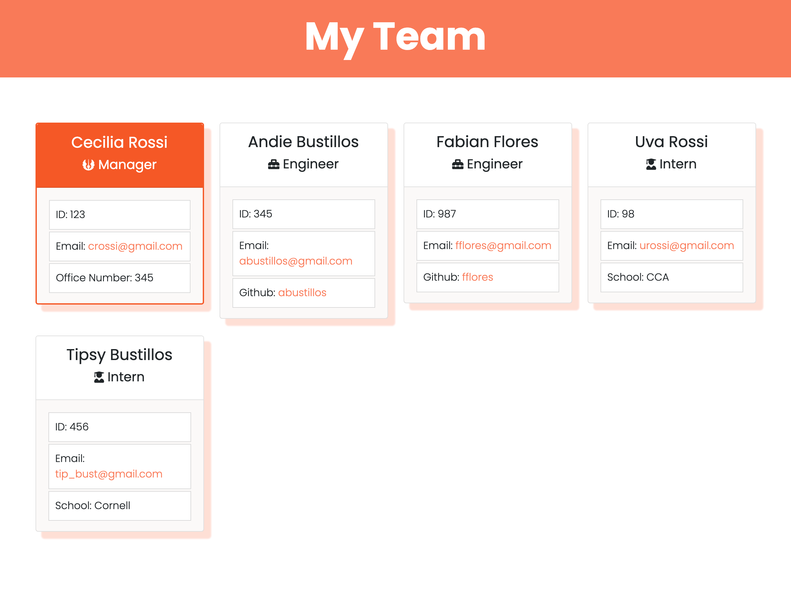

# Team Profile Generator 

## Description: 
> A command line application, using Node.js, that prompts users for information about their team members and uses the input to populate and generate a webpage that displays the team's basic information for easy access.

## Table of Contents
* [Installation](#Installation)
* [Usage](#Usage)
* [Demo](#Demo)
* [Test](#Test)
* [Questions](#Questions)

## Installation:
To install the application clone the repository and run 'npm i' in the command line to install dependencies.

## Usage:
* After installing dependencies simply run 'node index' in the command line to start the application 
* Prompts will appear to add the appropriate information for the team Manager and any Engineers and Interns you want to add to the team.
* When you are done adding team members simply select 'All done, build my team' and the information will populate index.html in the dist folder.

Screenshot of webpage once you open it in the browser:

## Demo:

Link to full video: https://drive.google.com/file/d/19vbHYocUKHWsRlKKkmT-VIr9TAniznAD/view

## Test:
To test execute 'npm run test' in the command line, all tests created using jest.

## Questions:
GitHub: [crossigarcia](https://github.com/crossigarcia) 

For additional information on this project you can email your questions here: <cecilia.rossi.garcia@gmail.com>  

